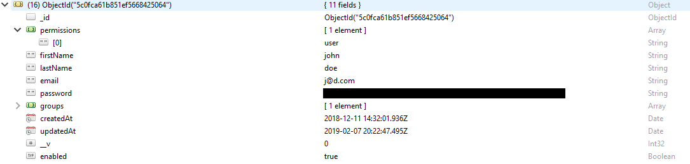

.. This work is licensed under a Creative Commons Attribution 4.0 International License.
.. http://creativecommons.org/licenses/by/4.0
..
.. Copyright (C) 2019 AT&T Intellectual Property

Developer-Guide
===============

.. contents::
   :depth: 3
   :local:

.. note:
..   * This section is used to describe what a contributor needs to know in order to work on the componenta

..   * this should be very technical, aimed at people who want to help develop the components

..   * this should be how the component does what it does, not a requirements document of what the component should do

..   * this should contain what language(s) and frameworks are used, with versions

..   * this should contain how to obtain the code, where to look at work items (Jira tickets), how to get started developing

..   * This note must be removed after content has been added.

Deployment
----------
The following are typical steps used to deploy and run different components of OTF.

OTF Frontend
^^^^^^^^^^^^
1) docker build -t otf-frontend:0.0.1-SNAPSHOT .
2) docker run -e OTF_URL='http://localhost:8082/ -d --network="host" otf-frontend:0.0.1-SNAPSHOT

OTF SERVICE API
^^^^^^^^^^^^^^^^
1) Modify src/main/resources/application.properties according to needs (disable aaf/ssl, set ports)
2) navigate to otf-service-api folder and run "docker build -t otf-service-api:0.0.1-SNAPSHOT -f docker/Dockerfile ." (maven will run from inside the container, command is inside the Dockerfile)
3) docker run -d --network="host" otf-service-api:0.0.1-SNAPSHOT

OTF CAMUNDA
^^^^^^^^^^^^
1) Modify src/main/resources/application.yaml according to needs, and validate the yaml is correct format (disable aaf/ssl, set ports)
2) navigate to otf-camunda folder and run "docker build -t otf-camunda:0.0.1-SNAPSHOT -f docker/Dockerfile ." (maven will run from inside the container, command is inside the Dockerfile)
3) docker run -d --network="host" otf-camunda:0.0.1-SNAPSHOT

Virtual Test Head (VTH)
^^^^^^^^^^^^^^^^^^^^^^^
VTH can be deployed in many ways. The following is a simple example of running vths via docker and using it on OTF UI.

    - Sample vth deployment example
        1) docker build -t [VTH_NAME] .
        2) docker run --rm --network [NETWORK-NAME] --name [VTH-NAME] -dit [DOCKER_IMAGE_NAME]
        3) use url and port to onboard it via OTF UI (instructions can be found in  user guide)

To update vth port, you will have to update its python file (App.py). Most of them will default to port 5000.

OTF-DATABASE
-------------

1) run sudo installdbs.sh and export PATH=/usr/local/mysql/bin:$PATH to add mysql commands to path
2) run sudo createMongoUser.sh
3) edit mongo to create a replica set by modifying replication and net fields on file /etc/mongod.conf
    - add security: authorization: 'enabled'
4) after script is ran mysql should be able to be used, connect to mysql using the password set by script and mysql command and
    - alter the root password
        - alter user 'root'@'localhost' identified by 'new_password'
    - grant root ability to connect remotely
        - grant all on *.* to 'root'@'%' identified by 'password'
    - create db and exit mysql shell
        - create database 'new_db'
    - create tables using mysql scripts
        - mysql -u root -p db < engine.sql

Common issues
--------------
Unable to log in to OTF UI as the first user on the platform
^^^^^^^^^^^^^^^^^^^^^^^^^^^^^^^^^^^^^^^^^^^^^^^^^^^^^^^^^^^^^
When registering as a new user, you will eventually need an admin to "enable" you. If you are the first User,
there will be no admin and you will be unable to log in even after you register. In order to fix this, you will have to
manually go into the mongo database and alter certain enabled and permission attribute for this new user.

- make sure enabled is set to true
- on the permission section, change role from user to admin

Processes
---------

Actions
-------

